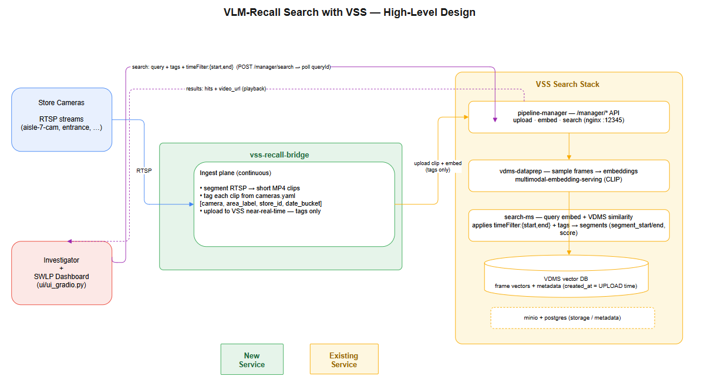
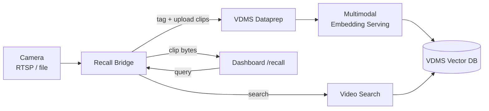

# VLM Recall Search

VLM Recall Search lets an investigator find historical footage with a plain‑English
query such as:

> "Show me the person in a blue shirt between 2:00–3:00 PM at the entrance camera."

It is hybrid recall over recorded video: appearance is matched by multimodal
embeddings, time is matched by a capture‑time filter, and location is matched by a
per‑camera tag. Results are short video clips you can play back directly in the
dashboard.

## Architecture



## How It Works

Recall is powered by the **Video Search & Summarization (VSS)** stack plus a thin
**recall bridge**. The bridge segments each camera into short MP4 clips, tags them,
and uploads them to VSS — which owns the embedding index, the time filter, and clip
storage. Nothing is duplicated on the SWLP side: every field an investigator sees
comes straight from VSS.



| Query part | Example | Matched by |
|------------|---------|------------|
| Appearance | `person in a blue shirt` | VSS multimodal frame embeddings (VDMS) |
| Time | `2:00–3:00 PM` | VSS absolute `timeFilter` on capture time |
| Location | `entrance` / `cam2` | Per‑camera upload **tags** |

Each search hit returns `video_id`, `tags`, `created_at`, `segment_start/end`, and a
relevance score. The bridge fetches the clip bytes by `video_id` and the UI streams
them with HTTP range support, so you can seek straight to the matched moment.

## Services

The recall feature adds these containers to the stack:

| Service | Role |
|---------|------|
| **multimodal-embedding-serving** | Encodes frames and text into the same vector space (`EMBEDDING_MODEL_NAME`, default `CLIP/clip-vit-b-32`). |
| **vdms-dataprep** | Ingests/segments clips and writes embeddings. |
| **vdms-vector-db** | Stores frame embeddings for similarity search. |
| **video-search** | Runs the similarity + tag + time query. |
| **pipeline-manager** | Orchestrates ingest/search; uses the shared `pgserver` database `video_summary_db`. |
| **vss-recall-bridge** | Tags cameras, uploads clips, proxies search and clip playback to the UI. |

## Enable and Run

Recall is on by default. Start the full stack from the application directory:

```bash
make up
```

This builds the bridge and UI, brings up the search services, and links the bridge to
the LP network. When it finishes, open the Investigator UI:

```
http://localhost:7860/recall
```

To run the search stack on its own (separate from the LP UI):

```bash
make run-search   # Investigator UI on http://localhost:7861/recall
```

The `Makefile` already sets sensible defaults, so nothing is mandatory. To override the
defaults, either pass them on the `make` command line or export them before running
`make up`:

```bash
export SEARCH_REGISTRY=intel/                       # search image registry
export TAG=latest                                   # image tag (shared with LP images)
export EMBEDDING_MODEL_NAME=CLIP/clip-vit-b-32       # multimodal embedding model
make up
```

| Variable | Default | Purpose |
|----------|---------|---------|
| `SEARCH_REGISTRY` | `intel/` | Registry for the VSS search images. |
| `TAG` | `latest` | Image tag, shared by the LP and VSS search images. |
| `EMBEDDING_MODEL_NAME` | `CLIP/clip-vit-b-32` | Multimodal model used for text+frame embeddings. |
| `ENABLE_SEARCH` | `true` | Set `false` to skip the recall stack entirely. |

Postgres/MinIO credentials are optional (they default in the compose files and the
shared `pgserver` is used), so they don't need exporting. Equivalent one-liner:
`make up EMBEDDING_MODEL_NAME=<model> TAG=<tag>`.

## Configure Cameras

Cameras are tagged once in `vss-recall-bridge/configs/cameras.yaml`. Each enabled
camera is segmented and uploaded with its tags so location filtering works:

```yaml
cameras:
  - id: cam2
    source_file: /media/lp-camera1.mp4   # or an RTSP url
    enabled: true
    area_label: entrance
    store_id: store-001
    extra_tags: ["front-of-store"]
```

A clip from this camera is tagged `cam2`, `entrance`, `store-001`, `front-of-store`,
so a query filtered to any of those tags returns it.

## Search From the UI

1. Open `/recall` on the dashboard.
2. Type a description (e.g. *person in a blue shirt*).
3. Optionally set the **From** / **To** window — pick the times in the date pickers; the
   UI sends them as UTC, which is what VSS expects.
4. Matching clips load automatically and seek to the matched moment for playback.

## Troubleshooting

- **No results with a time filter:** use the UI date pickers (they send UTC). Direct API
  calls with naive local timestamps are treated as UTC by VSS.
- **No results for a camera:** check the camera is `enabled: true` in `cameras.yaml` and
  re‑run; only enabled cameras are ingested.
- **`/recall` shows 404:** rebuild the UI image (`make up` rebuilds it).
- **pipeline-manager keeps restarting (`database "video_summary_db" does not exist`):**
  start with `make up`, which creates the database on `pgserver` automatically.
