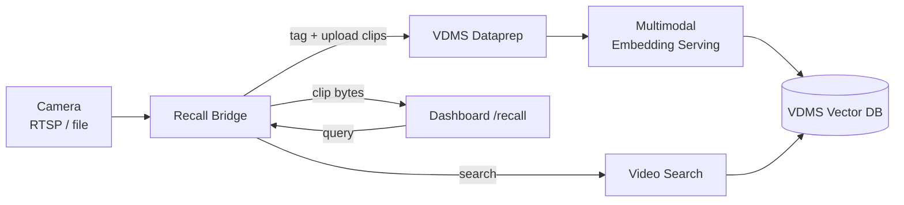

# VLM Recall Search

VLM Recall Search lets an investigator find historical footage with a plain‑English
query such as:

> "Show me the person in a blue shirt between 2:00–3:00 PM at the entrance camera."

It is hybrid recall over recorded video: appearance is matched by multimodal
embeddings, time is matched by a capture‑time filter, and location is matched by a
per‑camera tag. Results are short video clips you can play back directly in the
dashboard.

## Architecture


## How It Works

Recall is powered by the **Video Search & Summarization (VSS)** stack plus a thin
**recall bridge**. The bridge segments each camera into short MP4 clips, tags them,
and uploads them to VSS — which owns the embedding index, the time filter, and clip
storage. Nothing is duplicated on the SWLP side: every field an investigator sees
comes straight from VSS.



| Query part | Example | Matched by |
|------------|---------|------------|
| Appearance | `person in a blue shirt` | VSS multimodal frame embeddings (VDMS) |
| Time | `2:00–3:00 PM` | VSS absolute `timeFilter` on capture time |
| Location | `entrance` / `cam2` | Per‑camera upload **tags** |

Each search hit returns `video_id`, `tags`, `created_at`, `segment_start/end`, and a
relevance score. The bridge fetches the clip bytes by `video_id` and the UI streams
them with HTTP range support, so you can seek straight to the matched moment.

## Services

The recall feature adds these containers to the stack:

| Service | Role |
|---------|------|
| **multimodal-embedding-serving** | Encodes frames and text into the same vector space (`EMBEDDING_MODEL_NAME`, default `CLIP/clip-vit-b-32`). |
| **vdms-dataprep** | Ingests/segments clips and writes embeddings. |
| **vdms-vector-db** | Stores frame embeddings for similarity search. |
| **video-search** | Runs the similarity + tag + time query. |
| **pipeline-manager** | Orchestrates ingest/search; uses the shared `pgserver` database `video_summary_db`. |
| **vss-recall-bridge** | Tags cameras, uploads clips, proxies search and clip playback to the UI. |

## Enable and Run

Which stack `make up` brings up is controlled by **`MODE`**:

| Command | What runs | Recall UI |
|---------|-----------|-----------|
| `make up` *(`MODE=core`, default)* | SceneScape + Suspicious Activity **only** — no search | Recall button hidden |
| `make up MODE=full` | core **+** the search/recall stack | `http://localhost:7860/recall` (in the dashboard) |
| `make up MODE=search` | **only** the standalone search/recall stack | `http://localhost:7860/recall` (standalone UI) |

> Search is **opt-in**: a plain `make up` does not start the recall stack. Use
> `MODE=full` to include it, or `MODE=search` to run search by itself.

Tear down with the matching mode:

```bash
make up MODE=full        &&  make down                # `make down` also cleans a stray search stack
make up MODE=search      &&  make down MODE=search    # (plain `make down` also cleans it, best-effort)
```

### Overriding defaults

The `Makefile` sets sensible defaults, so nothing else is mandatory. To override,
pass variables on the command line or export them first:

```bash
make up MODE=full EMBEDDING_MODEL_NAME=CLIP/clip-vit-b-32 TAG=latest
```

| Variable | Default | Purpose |
|----------|---------|---------|
| `MODE` | `core` | `core` (no search) · `full` (core + search) · `search` (search only). |
| `SEARCH_REGISTRY` | `intel/` | Registry for the VSS search images. |
| `TAG` | `latest` | Image tag, shared by the LP and VSS search images. |
| `EMBEDDING_MODEL_NAME` | `CLIP/clip-vit-b-32` | Multimodal model used for text+frame embeddings. |
| `RECALL_UI_PORT` | `7860` | Host port for the standalone Investigator UI (`MODE=search`). |

**Legacy aliases** (still work, map onto `MODE`): `ENABLE_SEARCH=true` → `MODE=full`;
`SEARCH_ONLY=true` → `MODE=search`.

Postgres/MinIO credentials are optional (they default in the compose files and the
shared `pgserver` is used), so they don't need exporting.

## Disable Recall

Recall is **off by default** — a plain `make up` (`MODE=core`) already skips it. With
search disabled:

- The VSS search services and the `vss-recall-bridge` are never started.
- The dashboard hides the **Recall** button, and the `/recall` page returns
  *"Recall Search is disabled."* — so operators don't see a broken tab.

This is wired automatically: the UI reads `ENABLE_RECALL`, which the `Makefile`
derives from `MODE` (true for `full`/`search`, false for `core`). In standalone
`MODE=search`, the recall page also hides its **← Dashboard** back-link, since no
dashboard is running.

## Configure Cameras

Cameras are **not** configured in the bridge — they are derived automatically from
SceneScape's `configs/scene-config.yaml`. Every camera name listed under a scene is
segmented, uploaded, and tagged so location filtering works:

```yaml
scenes:
  - scene_name: storewide loss prevention
    cameras:
      - lp-camera1
    zones:
      aisle1: HIGH_VALUE
      aisle2: CHECKOUT
```

For each camera name the bridge derives:

- **RTSP source** — `${RECALL_RTSP_BASE_URL}/<camera-name>`
  (e.g. `rtsp://mediaserver:8554/lp-camera1`).
- **Tags** — the camera name plus the scene's zone names (`aisle1`, `aisle2`), and the
  optional `STORE_ID`. A query filtered to any of those tags returns that camera's clips.

Adding a camera in SceneScape (a new name under `scenes[].cameras`) is the only step
needed to ingest it — there is no separate camera file to edit.

## Search From the UI

1. Open `/recall` on the dashboard.
2. Type a description (e.g. *person in a blue shirt*).
3. Optionally set the **From** / **To** window — pick the times in the date pickers; the
   UI sends them as UTC, which is what VSS expects.
4. Matching clips load automatically and seek to the matched moment for playback.

## Troubleshooting

- **No results with a time filter:** use the UI date pickers (they send UTC). Direct API
  calls with naive local timestamps are treated as UTC by VSS.
- **No results for a camera:** check the camera name is listed under `scenes[].cameras`
  in `configs/scene-config.yaml`; only cameras defined there are ingested.
- **`/recall` shows 404:** rebuild the UI image (`make up` rebuilds it).
- **pipeline-manager keeps restarting (`database "video_summary_db" does not exist`):**
  start with `make up`, which creates the database on `pgserver` automatically.
