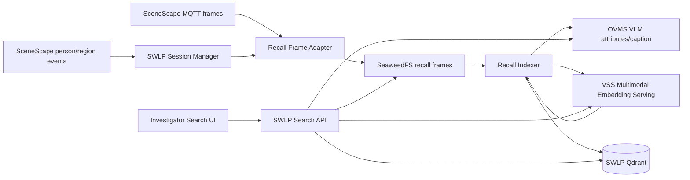
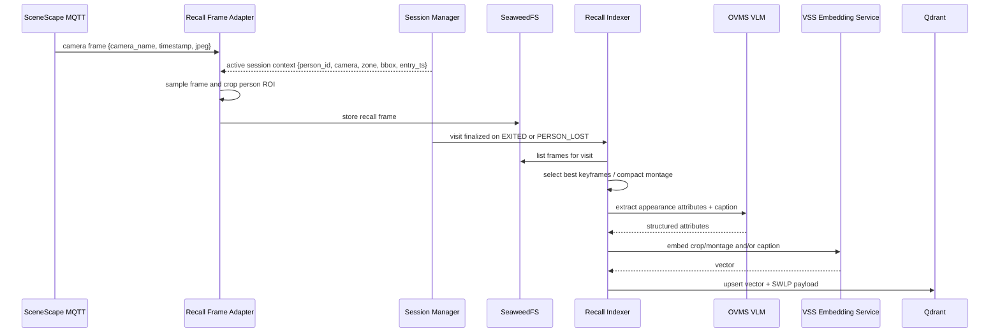

# VLM-Powered Attribute Search With VSS

Status: Draft / Proposal
Component: `storewide-loss-prevention/suspicious-activity-detection`

## 1. Use Case

> "Show me the person in a blue shirt between 2:00-3:00 PM near aisle 7."

This is hybrid recall:

| Query part | Example | Retrieval method |
|------------|---------|------------------|
| Appearance | `person in a blue shirt` | VLM attributes + VSS embeddings |
| Time | `2:00-3:00 PM` | vector DB payload filter |
| Location | `near aisle 7` | `zone_id` / `camera_id` payload filter |

A returned "clip" is not a stored MP4. Today SWLP stores JPG frames in SeaweedFS, so a
clip is a logical person-visit reconstructed as a thumbnail or montage from those frames.

## 2. Current Repo Hooks

| Need | Existing hook | Use in recall feature |
|------|---------------|-----------------------|
| SceneScape frames | `swlp-service/services/mqtt_service.py` dispatches `scenescape/image/camera/+` | Feed recall frame adapter |
| Person identity | `SessionManager.on_scene_data()` keeps canonical `object_id`, cameras, bbox | Group matches across cameras by `person_id` |
| Zone visits | `SessionManager.on_region_event()` emits `ENTERED` / `EXITED` with visit timestamps | Create index records per person visit |
| Frame storage | `FrameManager.store_person_frame()` writes to SeaweedFS | Reuse storage pattern, add recall-specific prefix |
| VLM | `behavioral-analysis/src/vlm_client.py` calls OVMS VLM | Extract appearance attributes and parse queries |
| API | `swlp-service/api/routes.py` owns `/api/v1/lp/*` | Add search and montage endpoints |
| UI | `ui/ui_gradio.py` serves dashboard | Add Investigator Search UI |

Important current limitation: the existing BA frame path stores full camera frames and is
focused on `HIGH_VALUE` zones. Offline recall needs a recall-specific capture/index path
that can include aisle zones and crop the person ROI before embedding.

## 3. Design Decision

Use VSS for **embedding generation**, not as the owner of the recall index.

SWLP should own:

- person identity and cross-camera grouping
- time/zone/camera filters
- Qdrant payload schema
- SeaweedFS evidence references
- search API and UI

VSS should provide:

- multimodal embedding service for person crops, montage images, and/or query text

Reason: the VSS video-search ingestion path is file/video oriented. This recall use case is
person-visit oriented and depends on SWLP metadata that VSS does not own.

## 4. Architecture



## 5. Indexing Flow



Index one record per person visit per camera/zone.

Recommended payload:

```text
clip_id        : uuid
person_id      : SceneScape canonical object_id
scene_id       : SceneScape scene UUID
camera_id      : camera name/id
zone_id        : region UUID
zone_name      : human name, e.g. aisle 7
start_ms       : visit start epoch ms
end_ms         : visit end epoch ms
attributes     : VLM JSON, e.g. upper_color=blue
caption        : normalized appearance caption
thumbnail_key  : SeaweedFS key
frame_keys     : ordered SeaweedFS frame keys
```

## 6. Query Flow

```mermaid
sequenceDiagram
    participant U as Investigator
    participant API as SWLP Search API
    participant VLM as OVMS VLM parser/verifier
    participant VSS as VSS Embedding Service
    participant QD as Qdrant
    participant S3 as SeaweedFS

    U->>API: Show me the person in a blue shirt between 2:00-3:00 PM near aisle 7
    API->>VLM: parse query into semantic text + filters
    VLM-->>API: semantic_text, time_range, zone_hint, attributes
    API->>API: resolve aisle 7 to zone_id/camera_id; convert local time to epoch_ms
    API->>VSS: embed semantic_text
    VSS-->>API: query vector
    API->>QD: vector search with hard filters {time overlap, zone_id/camera_id}
    QD-->>API: candidate person visits
    opt precision mode
        API->>S3: fetch top-N thumbnails
        API->>VLM: verify requested attributes
        VLM-->>API: yes/no + confidence
    end
    API-->>U: grouped results with thumbnail + montage URLs
```

Search filter logic:

```text
start_ms < query_end_ms AND end_ms > query_start_ms
AND zone_id IN resolved_zone_ids
AND optional camera_id IN resolved_camera_ids
```

## 7. Components To Build

1. **Recall Frame Adapter**: `swlp-service/services/recall_frame_adapter.py`
   - Register as another camera-image consumer or fan out from `MQTTService`.
   - Use active `PersonSession` state to associate frames with person/zone/camera.
   - Sample frames; do not embed every MQTT frame.
   - Crop person ROI from `session.bbox` or SceneScape camera bounds.
   - Store selected frames under a recall prefix in SeaweedFS.

2. **Recall Indexer**: `swlp-service/services/recall_indexer.py` or standalone service
   - Trigger on `EXITED` / `PERSON_LOST`.
   - Select keyframes, call OVMS VLM, call VSS embeddings, upsert Qdrant.
   - Support one-shot backfill over existing SeaweedFS frames.

3. **VSS Embedding Client**
   - Wrap VSS Multimodal Embedding Serving behind a small client.
   - Hide endpoint/model details behind `EMBEDDING_BACKEND=vss_multimodal`.

4. **Qdrant Service**
   - Add to `docker/docker-compose.yaml` with a persistent volume.
   - Collection should support payload filters on time, zone, camera, and person.

5. **Search API**: `swlp-service/api/routes.py`
   - `POST /api/v1/lp/search/clips`
   - `GET /api/v1/lp/search/clips/{clip_id}/thumbnail`
   - `GET /api/v1/lp/search/clips/{clip_id}/montage`

6. **Investigator Search UI**: `ui/ui_gradio.py`
   - Query box, time range, zone/camera filters.
   - Results gallery grouped by `person_id` with thumbnail and montage playback.

## 8. API Shape

Request:

```json
{
  "query": "person in a blue shirt between 2:00-3:00 PM near aisle 7",
  "time_start": null,
  "time_end": null,
  "zone": null,
  "camera_id": null,
  "limit": 20,
  "rerank": true
}
```

Response:

```json
{
  "results": [
    {
      "clip_id": "...",
      "person_id": "...",
      "camera_id": "lp-camera1",
      "zone_name": "aisle 7",
      "start_time": "2026-06-10T14:05:12Z",
      "end_time": "2026-06-10T14:06:03Z",
      "score": 0.87,
      "attributes": {"upper_color": "blue", "upper_type": "shirt"},
      "thumbnail_url": "/api/v1/lp/search/clips/.../thumbnail",
      "montage_url": "/api/v1/lp/search/clips/.../montage"
    }
  ]
}
```

## 9. Phased Plan

1. **Index foundation**: Qdrant, VSS embedding client, recall frame adapter, recall indexer.
2. **Search API**: query parser, zone/time resolution, vector search, thumbnail endpoint.
3. **UI**: Investigator Search tab/section with result gallery and montage playback.
4. **Precision**: optional VLM re-rank, better crop selection, named vectors for image + text.

## 10. Open Decisions

- Which zones are recall-enabled: all zones, selected zones, or zone config flag?
- Where to run recall indexer: inside `swlp-service` or as a separate service?
- Which VSS embedding mode to use first: image crop, montage image, caption text, or named vectors?
- Retention policy for recall frames, attributes, and vectors.
- Store-local timezone source for natural-language time parsing.
