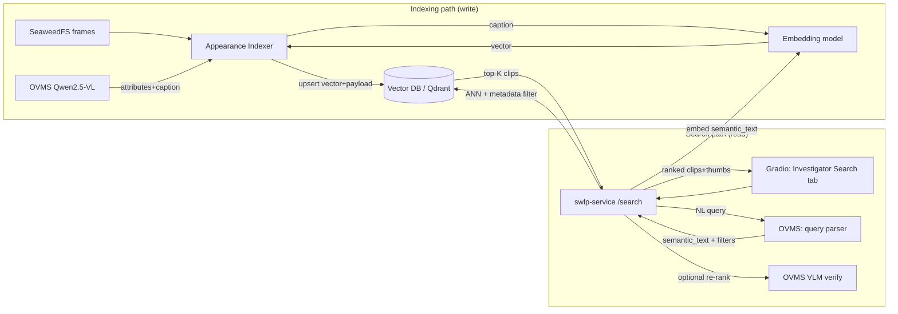
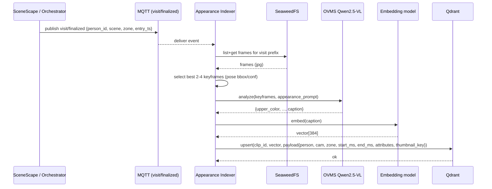
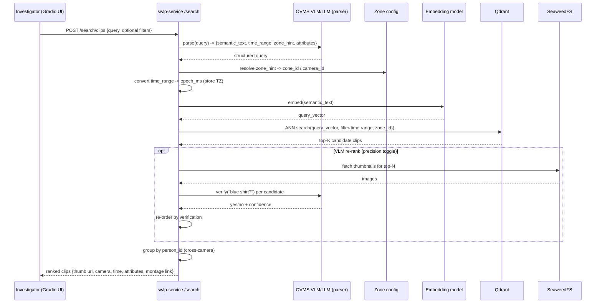
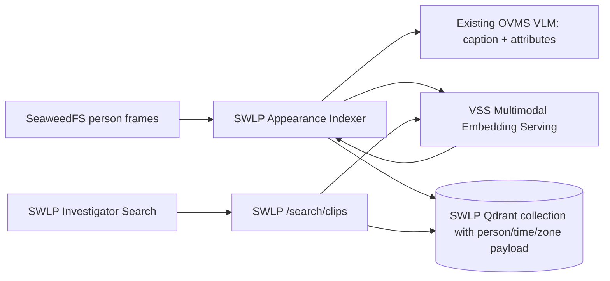
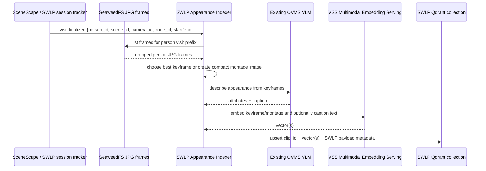
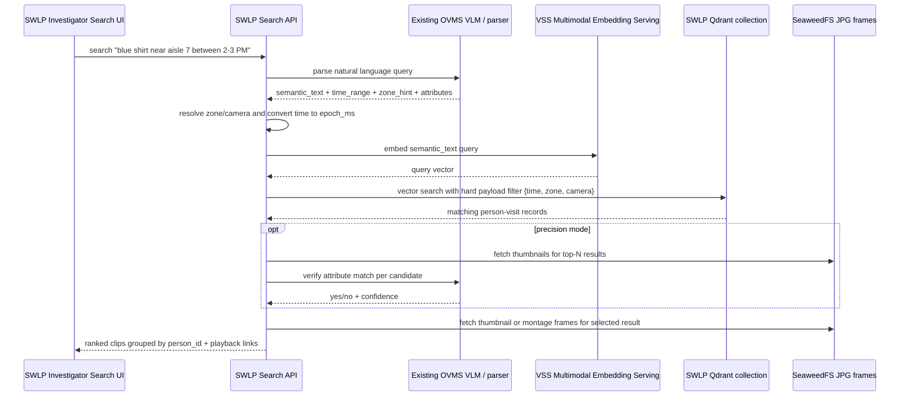

# VLM-Powered Attribute Search — Design

Status: Draft / Proposal
Component: `storewide-loss-prevention/suspicious-activity-detection`

## 1. The use case, restated as a system contract

> *"Show me the person in a blue shirt between 2:00–3:00 PM near aisle 7."*

Decomposed, every investigator query is three things:

| Part | Example | How we satisfy it |
|------|---------|-------------------|
| **Semantic attribute** | "person in a blue shirt" | VLM-derived appearance description → vector similarity |
| **Time filter** | "between 2:00–3:00 PM" | metadata range filter on `epoch_ms` |
| **Location filter** | "near aisle 7" | metadata equality/IN filter on `zone_id` / `camera_id` |

So this is **hybrid retrieval**: a hard metadata pre-filter (time + place) combined with
a soft semantic ANN search (appearance). "VLM for recall" = the VLM is the *indexer* that
turns pixels into searchable descriptions, and optionally the *verifier* that re-ranks top hits.

> **Note on "clip":** Today the system stores **only individual JPG frames** in SeaweedFS
> (`.../frames/{epoch_ms}.jpg`) — there is **no mp4 / video clip** persisted anywhere. So
> throughout this doc a "clip" is a **logical unit = one person-visit**, represented by its
> frame set. The visual evidence we return is reconstructed *from those frames* (a
> thumbnail, or an on-demand montage / animated GIF / MP4 stitched on request). We are not
> introducing continuous video recording; we index and serve what already exists.

## 2. What already exists (and what we reuse)

Most of the heavy infrastructure is already in the stack, so this is mostly *additive*.

- **Qwen2.5-VL-7B on OVMS** — already deployed, already used per-visit in
  `behavioral-analysis/src/vlm_client.py`. We reuse `VLMClient.analyze()` for appearance
  extraction and query parsing.
- **SeaweedFS** — person frames already stored at
  `{scene_id}/{entity_id}/{region_id}/{entry_timestamp}/frames/{epoch_ms}.jpg`
  (`behavioral-analysis/src/seaweedfs_client.py`). No new image capture needed — we index
  what's already there.
- **SceneScape re-id** — gives a *global* `object_id` per person across cameras, so
  "across all cameras" comes for free by grouping on `person_id`.
- **MQTT** (`ba/requests`, `ba/results`) — event backbone to trigger indexing.
- **FastAPI swlp-service** (`swlp-service/api/routes.py`) + **Gradio UI** — where search
  endpoints and the search tab go.

**What's missing and must be added:** a vector DB, a text-embedding endpoint, an indexer
that writes records, a search API, and a UI tab.

## 3. High-level architecture



Two new containers (**Vector DB**, **Embedding endpoint**) and one new logical component
(**Appearance Indexer**). Everything else is endpoints/UI on existing services.

## 3a. Indexing flow (sequence)



## 3b. Query flow (sequence)



## 4. The indexing pipeline (the "recall" foundation)

A person-visit produces frames in SeaweedFS. When a visit finalizes (SceneScape
`EXITED` / `PERSON_LOST`, or on a periodic flush), the **Appearance Indexer**:

1. **Selects keyframes** — pull the visit's frames; pick the best 2–4 (reuse YOLO-pose
   bbox/confidence already computed in BA to choose frames where the person is large,
   centered, unoccluded).
2. **Runs the VLM appearance prompt** once per visit → structured JSON:
   ```json
   {
     "upper_color": "blue", "upper_type": "shirt",
     "lower_color": "black", "lower_type": "jeans",
     "headwear": "none", "bag": "backpack", "footwear": "white sneakers",
     "gender_presentation": "male", "approx_age": "adult",
     "distinguishing": "red logo on chest",
     "caption": "An adult male in a blue button-up shirt and black jeans carrying a black backpack and wearing white sneakers."
   }
   ```
3. **Embeds the `caption`** via the text-embedding model → e.g. 384-d vector.
4. **Upserts one record** into the vector DB:
   ```text
   clip_id        : uuid
   person_id      : SceneScape object_id   (cross-camera key)
   scene_id, camera_id, zone_id, zone_name : location
   start_ms, end_ms                        : time window of the visit
   vector         : caption embedding
   attributes     : {upper_color, ...}     (structured, filterable/boostable)
   caption        : full text
   thumbnail_key  : best keyframe S3 key (points at an existing frame)
   frame_prefix   : SeaweedFS prefix listing all frames for this visit
   frame_keys     : ordered list of frame S3 keys (epoch_ms)
   ```

   No pixels are copied into the vector DB — only the **S3 keys** of frames that already
   exist. `thumbnail_key`/`frame_prefix` are references; the bytes stay in SeaweedFS.

This makes each *person-visit per camera* one searchable, explainable record. Indexing is
**off the real-time path** (consumes a `visit/finalized` event), so it never slows live
detection.

### 4a. Visual evidence — there is no stored video

**Showing the person clip in the UI is a core requirement of this recall feature** — an
investigator must visually confirm the match, not just read attributes. Because only JPG
frames exist, that clip is **reconstructed on demand** from those frames:

- **Thumbnail** — return the single best keyframe (`thumbnail_key`) directly from SeaweedFS.
  Shown in the results gallery for fast scanning.
- **Clip / montage** — `GET /search/clips/{clip_id}/montage` reads `frame_keys` from the
  vector DB, fetches the frames from SeaweedFS, and stitches them into an **animated GIF or
  a short MP4** *at request time* (cached). This is what plays when the investigator opens a
  result. It is a **time-lapse-style clip** (a few frames per second), not smooth 30 fps
  CCTV — enough to confirm "yes, that's the blue-shirt person."
- **Optional future** — if true continuous-footage playback is desired, add a recorder that
  segments source RTSP to MP4; the schema's `frame_prefix` would then be joined by a
  `video_key`. That is **out of scope** for this design.

**Frame density matters for watchability.** Playback quality is bounded by how many frames
the capture cadence stored per visit. The orchestrator currently captures ~5 frames/sec
per visit (`frame_capture_count=5`, `frame_capture_interval_seconds=1.0`). For a usable clip
we should: (a) keep enough frames per visit for a coherent montage, and (b) let the montage
endpoint control playback fps (e.g. 5–10 fps) so short visits still produce a viewable clip.
If smoother playback is required without full recording, raise the capture cadence for the
search use case — at the cost of more SeaweedFS storage.

## 5. The query pipeline

`POST /api/v1/lp/search/clips`
```json
{ "query": "person in a blue shirt between 2:00-3:00 PM near aisle 7",
  "time_start": null, "time_end": null, "camera_id": null, "zone": null }
```

1. **Query understanding** — send the NL query to the VLM/LLM with a parser prompt that
   returns:
   ```json
   { "semantic_text": "person wearing a blue shirt",
     "time_range": {"start":"14:00","end":"15:00"},
     "zone_hint": "aisle 7", "attributes": {"upper_color":"blue"} }
   ```
   (Structured form fields in the request override/augment the parse, so the UI can also
   supply explicit time pickers and dropdowns.)
2. **Resolve filters** — convert "2–3 PM" to `epoch_ms` in store-local TZ; map "aisle 7"
   to a `zone_id`/`camera_id` using the existing zone config.
3. **Embed** `semantic_text` with the same embedding model used at ingest.
4. **Vector search** — ANN over the caption vectors **with a hard payload filter**:
   `start_ms < end AND end_ms > start AND zone_id == aisle_7`. Optional soft boost when
   `attributes.upper_color == "blue"`.
5. **(Optional) VLM re-rank for precision** — take top-N hits, fetch their thumbnail, ask
   the VLM "Is this person wearing a blue shirt? yes/no + confidence" and re-order. This
   closes the loop ("VLM for recall *and* precision") at the cost of a few extra calls —
   make it a toggle.
6. **Return ranked clips**, grouped by `person_id` to show the same individual across
   cameras, each with thumbnail URL, camera, time, attributes, and an on-demand montage link.

## 6. Technology choices (Intel/OpenVINO-aligned)

| Concern | Recommendation | Why |
|---------|----------------|-----|
| Vector DB | **Qdrant** (single container) | excellent payload filtering (critical for time+zone), simple ops, named-vector support for adding image vectors later |
| Text embeddings | `BAAI/bge-small-en-v1.5` or `e5-small-v2` served on **OVMS** | keeps the Intel/OpenVINO stack; small + fast |
| Appearance extraction | existing **Qwen2.5-VL on OVMS** | no new model; reuse `VLMClient` |
| "Clips" / playback | **thumbnail + on-demand montage** built from existing JPG frames | no video is stored; reconstruct from frames at request time, optional mp4 export later |

**Why caption+text-embedding over a pure CLIP image search:** the existing VLM is already
deployed and is far stronger on *fine compositional attributes* ("blue shirt, black
backpack") than CLIP, and the structured attributes give precise, explainable metadata
filters. A CLIP image vector can be added later as a second named vector for pure visual
similarity / re-ranking — the schema already reserves room for it.

## 7. Can we integrate Video Search and Summarization (VSS)?

Short answer: **yes, but not as a drop-in replacement for this recall feature.** The VSS
sample is very relevant as a reusable Intel/OpenVINO search stack, especially its
multimodal embedding and video-search services. However, its default search path is built
around ingesting videos, sampling frames, embedding them, and searching those frame/video
records. This app's recall unit is different: a **SceneScape person-visit** backed by
already-stored cropped JPG frames in SeaweedFS, plus store-specific metadata
(`person_id`, `scene_id`, `camera_id`, `zone_id`, `start_ms`, `end_ms`).

The useful VSS building blocks are:

| VSS part | What it gives us | Fit for SWLP recall |
|----------|------------------|---------------------|
| **Multimodal Embedding Serving** | HTTP/API embedding endpoint for models such as `CLIP/clip-vit-b-32` | Good fit as an optional image/multimodal embedding backend |
| **Video Search / `search-ms`** | Search microservice over generated embeddings | Useful reference, but its record model needs adaptation for person-visits and hard time/zone filters |
| **Data Prep / video ingestion** | Samples uploaded videos, extracts frames/ROIs, creates embeddings | Partial fit only; SWLP already has frames and ROIs, so re-ingesting video duplicates work |
| **Pipeline Manager APIs** | `/videos`, `/videos/search-embeddings/{videoId}`, `/search/query`, etc. behind `/manager` | Good for a sidecar/demo flow, less ideal for native investigator recall |
| **React UI / MCP / Helm** | Ready-made UX and deployment assets | Useful as reference; SWLP likely still needs Gradio/API integration for alert context |

### Recommended integration pattern

Use VSS **as a component source**, not as the owner of the recall index:



In this mode, the SWLP indexer sends either the best keyframe, a small montage image, or
the VLM-generated caption to an embedding endpoint. The resulting vector is stored in our
own Qdrant collection with the metadata required for investigator recall. This preserves
the core contract of the design: **hard filters by time/place/person, soft semantic recall
by appearance**.

### End-to-end flow with VSS embeddings

**Indexing / recall build path**



**Search / investigator recall path**



The important boundary is that VSS provides the **embedding capability**, while SWLP keeps
ownership of the recall object model. That lets us reuse Intel's VSS search foundation
without forcing SWLP to upload every visit as a standalone video or lose store-specific
filters.

The best first step is to make the embedding backend pluggable:

- `EMBEDDING_BACKEND=text` — current proposal: caption -> text embedding.
- `EMBEDDING_BACKEND=vss_multimodal` — use VSS Multimodal Embedding Serving for keyframe
  or montage embeddings.
- Add a second named vector later, e.g. `caption_vector` + `image_vector`, so text and
  visual recall can be blended without changing the API contract.

### Alternative: black-box VSS sidecar

For a quick demo, SWLP can generate one short MP4/montage per finalized visit, upload it
to VSS through the Pipeline Manager video APIs, trigger embedding generation, then call VSS
search APIs from the SWLP UI. This is viable, but it has important trade-offs:

- It requires producing derived video files even though SWLP currently stores only JPG
  frames.
- It duplicates storage and indexing work outside the existing SeaweedFS visit structure.
- VSS search results must be joined back to SWLP metadata to enforce `zone_id`,
  `camera_id`, `person_id`, and store-local time filters.
- Cross-camera grouping by SceneScape `object_id` remains SWLP-specific.
- It is heavier operationally because VSS search mode brings multiple services
  (pipeline manager, data prep/video ingestion, search service, embedding service, vector
  storage, UI/proxy).

This sidecar route is good for validating VSS quickly, but it should not be the long-term
architecture unless we also add continuous video recording and want VSS to own video asset
management.

### Decision

Proceed with the native SWLP recall design and integrate VSS selectively:

1. Keep SWLP-owned `POST /api/v1/lp/search/clips` and montage playback.
2. Add VSS Multimodal Embedding Serving as an optional embedding endpoint.
3. Keep Qdrant payload/schema in this app so time, zone, camera, and person grouping stay
   first-class.
4. Treat VSS video ingestion/search UI as a reference or demo sidecar, not the production
   recall owner.

## 8. Components to build (and where)

1. **Vector DB service** — add `qdrant` to `docker/docker-compose.yaml`, one named volume.
2. **Embedding endpoint** — add an embedding model to the OVMS config, a small sidecar, or
   the VSS Multimodal Embedding Serving container when `EMBEDDING_BACKEND=vss_multimodal`.
3. **Appearance Indexer** — either a new module inside `behavioral-analysis` (reuses
   `VLMClient` + `SeaweedFSClient`) consuming a `visit/finalized` event, or a thin
   standalone `attribute-indexer` service. *Recommendation: standalone service reusing the
   BA image* to keep the real-time detector lean.
4. **Search API** — new `search` router in `swlp-service/api`: `POST /search/clips`,
   `GET /search/clips/{clip_id}/montage`.
5. **UI** — new "Investigator Search" tab in the Gradio app: query box + time range +
   camera/zone dropdowns → results gallery. **Each result shows a playable clip** of the
   matched person (montage/GIF/MP4 reconstructed from frames) plus thumbnail, camera, time,
   and extracted attributes — so the investigator can visually confirm the recall hit.

## 9. Phased plan

- **Phase 1 — Index foundation:** Qdrant + embedding endpoint + indexer (live via
  `visit/finalized`, plus a one-shot backfill over existing SeaweedFS frames). Include the
  VSS embedding adapter in this phase if we choose the multimodal backend.
- **Phase 2 — Search API:** query parser + hybrid retrieval + montage builder.
- **Phase 3 — UI:** Investigator Search tab with gallery + playback.
- **Phase 4 — Precision & reach:** optional VLM re-rank, cross-camera person grouping,
  mp4 export, CLIP visual vector.

## 10. Things to decide / call out

- **Index granularity:** one record per *visit-per-camera* (recommended) vs. per-keyframe
  (finer recall, larger DB).
- **VSS integration depth:** embedding service only (recommended), black-box VSS sidecar
  for demo, or full VSS ownership if continuous MP4 recording is added later.
- **Privacy/retention:** appearance attributes + person crops are sensitive — store
  *attributes, not face biometrics*; add a retention TTL and access control on the search API.
- **TZ source:** the store-local timezone for parsing "2–3 PM" (UI already mounts
  `/etc/localtime`).
- **Indexer trigger:** is there a clean `visit finalized` signal today, or do we derive it
  from SceneScape `EXITED`/`PERSON_LOST` in the orchestrator?
