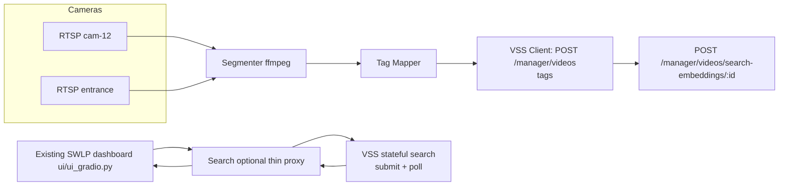
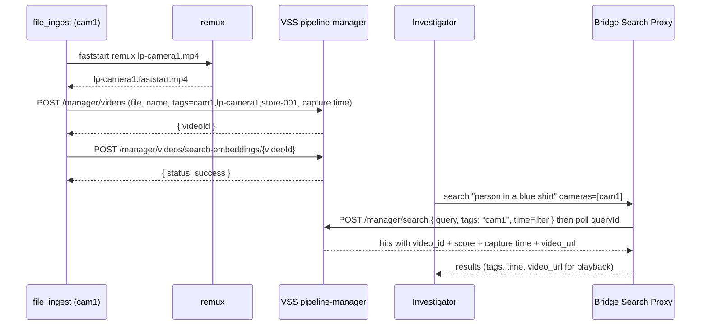

# VLM-Recall Search With VSS

Status: Approved — ready for development
Component: `storewide-loss-prevention/suspicious-activity-detection`

## 1. Use Case

> "Show me the person in a blue shirt between 2:00-3:00 PM at the entrance camera."

This is hybrid recall over historical footage:

| Query part | Example | Retrieval method |
|------------|---------|------------------|
| Appearance | `person in a blue shirt` | VSS multimodal frame embeddings |
| Time | `2:00-3:00 PM` | VSS `timeFilter` |
| Location | `entrance` / `cam-12` / `aisle-7-cam` | VSS upload `tag` (camera tag) |

A returned result is a short video clip (and its frames) that VSS already indexed, joined back
to the originating camera and any suspicious-activity event by a thin bridge service.

## 2. Approach In One Line

Tag each **camera** once, segment its **RTSP** stream into short MP4 clips, **tag and upload**
every clip (with its real **capture time**) to the **VSS search stack**, and let VSS own the
index, the time filter, and clip retrieval. The bridge is a **thin, stateless** service: it does
RTSP -> tag -> upload, and (optionally) proxies search. It keeps **no database** and **no mapping
table** — every field an investigator sees comes straight from VSS.

There is no per-frame aisle derivation, no rule/gating engine, no SWLP-owned vector database, and
no mapping DB. Location is a camera **tag** and time is a **capture-time filter** — both owned by
VSS.

> This design assumes one VSS fix lands: absolute time filtering (R1; see §3.1). Capture time is
> handled by near-real-time ingest + window padding (§3.2), so no new ingest field is required.

## 3. Why VSS Is Enough

The full VSS search stack is up and running (confirmed):
`nginx`, `pipeline-manager`, `video-search` (search-ms), `vdms-dataprep`, `vdms-vector-db`,
`multimodal-embedding-serving`, `minio-service`, `postgres-service`.

VSS answers all three parts of the query:

| Query part | How VSS answers it | Status |
|------------|--------------------|--------|
| `blue shirt` | multimodal frame-embedding similarity (VDMS) | Works |
| location (`entrance`, `aisle-7-cam`, `cam-12`) | upload **`tags`** filter (subset/OR match) | Works (verified, see §3.3) |
| `2:00-3:00 PM` | absolute `timeFilter:{start,end}` on **upload time** (+ chunk padding) | Works (R1 verified, see §3.1) |

Search hits already return everything the dashboard needs per segment: `video_id`, `video_url`,
`tags`, `created_at`, `segment_start/segment_end`, `relevance_score`. Clip retrieval by `video_id`
already works. So there is **nothing to enrich and nothing to store** on the SWLP side.

### 3.1 Absolute time filtering (R1 — fixed & verified)

Verified against the running stack on the stateful `POST /manager/search` (submit) +
`GET /manager/search/{queryId}` (poll) flow **and** the direct search-ms `POST /query`:

1. **Absolute time filtering now works.** A `timeFilter` with absolute `{start,end}` is applied
   end-to-end. A/B confirmed: for a clip with `created_at: 2026-06-25T04:27:41+00:00`, a window of
   `04:00–05:00` returns it (apple hit ranked #1, score 1.0) while `06:00–07:00` returns `[]` —
   same query and tags, only the window changed. The **relative** form (`{value, unit}`, "last N
   minutes") still works too. The earlier gateway gap in `normalizeTimeFilter` (absolute
   `start/end` dropped before reaching search-ms) is resolved.

With R1 in place VSS answers all three axes server-side and the bridge needs no state. VSS stores no
separate capture time — every hit's only timestamp is `created_at` = **upload** time (`date_time`
is always `""`). We do **not** need a new ingest field for live recall: because the bridge waits for
each chunk and then uploads, `created_at` ≈ capture time + ~one chunk, a fixed offset we absorb at
query time (§3.2).

> Optional future (R2): only if bulk **backfill/replay** of old footage is ever required does
> upload time stop being a proxy for capture time. The clean fix then is to have VSS accept a
> caller-supplied capture timestamp at ingest and match the time filter against it. **Not needed
> for live recall** — out of scope here.

### 3.2 Capture time via near-real-time ingest + drift padding

The bridge ingests in near-real-time (wait for a chunk, then upload) so `created_at` (upload time)
tracks capture time within one chunk length. The query proxy **pads the requested window by one
chunk** (segment size, e.g. ~5 min) so the absolute `timeFilter` (R1) reliably catches the right
clips. This needs no per-clip capture field and no bridge state; it assumes live ingest, not bulk
backfill (that is the R2 case in §3.1). Absolute time filtering (R1) is now live, so the padded
absolute window is the default path.

### 3.3 Tag-match semantics (verified)

Tag filtering is a **subset / OR match**: a clip is returned when it shares **any** of the requested
tags (search-ms intersects the query tag set with each result's tags).

- A clip tagged `[aisle1, aisle3]` **is** returned by `tags: "aisle1"` or by `tags: "aisle3"`
  alone, and by `tags: "aisle1,aisle3"`.
- A single-tagged clip (e.g. `retail`) is returned by `tags: "retail"`.
- Verified live: `tags: "flying-machine-retail"` consistently filters to clips carrying that tag.

Implication: the query can send a **single camera/area tag** (e.g. just `cam-12`) and still match
multi-tagged clips — no need to reproduce a clip's full tag set. The direct search-ms `POST /query`
honors both tags and `timeFilter`; the stateful submit+poll flow is still used for the managed UI
lifecycle.

## 4. Architecture



The bridge holds **no state**. The **query path is optional**: the dashboard can call VSS's
stateful search directly, or go through a thin proxy that only adds auth/audit and maps the LP
request shape (`{cameras, time_start, time_end}`) to VSS (`{tags, timeFilter:{start,end}}`). The
**ingest path is always required** because VSS does not segment or tag RTSP.

Proposed location for the new service:
`suspicious-activity-detection/vss-recall-bridge/`, added to `docker/docker-compose.yaml` on the
same network as the VSS stack.

## 5. Verified VSS API Contract

All paths are on the pipeline-manager, reached through nginx with the `/manager/` prefix
(default `http://<HOST_IP>:12345`). search-ms (`8000`), data-prep (`7890`), and embedding
serving (`9777`) are internal.

| Step | Method + Path | Body | Returns |
|------|---------------|------|---------|
| Upload clip | `POST /manager/videos` (multipart) | `video` (MP4), `name`, `tags` (comma-sep) | `{ "videoId": "..." }` |
| Create embeddings | `POST /manager/videos/search-embeddings/{videoId}` | none | `{ "status": "success" }` |
| Submit search | `POST /manager/search` | `{ "query", "tags" (comma-sep), "timeFilter": { "start", "end" } }` | `{ "queryId": "..." }` |
| Poll results | `GET /manager/search/{queryId}` | none | results; each hit `metadata` has `video_id`, `video_url`, `tags`, `created_at`, `segment_start/end`, `relevance_score` |
| Fetch clip | `GET /manager/videos/{videoId}` (then `video_url`) | none | clip bytes for playback |

### 5.1 Upload constraints

- Accepts **streamable MP4 only** (moov atom before mdat). **No RTSP URL** — file upload only
  (`pipeline-manager/.../video-validator.service.ts`).
- `tags` are accepted at upload and are the only per-video metadata channel -> this is where the
  **camera tag** goes.
- Embedding is **not** automatic; it is triggered by the explicit
  `POST /videos/search-embeddings/{videoId}` call.
- No capture-time field exists; only `created_at` (upload time). Near-real-time ingest + query
  padding (§3.2) make that sufficient, so no new ingest field is required for live recall.

### 5.2 Search: use the stateful flow

Filtered search works only on the **stateful** endpoint: `POST /manager/search` returns a
`queryId`; poll `GET /manager/search/{queryId}` for results. The one-shot
`POST /manager/search/query` ignores `tags` and `timeFilter` (returns everything) — **do not use
it** for filtered recall.

### 5.3 Time + tag behaviour (verified)

- Both **relative** `timeFilter:{value,unit}` and **absolute** `timeFilter:{start,end}` are applied
  (R1, verified A/B — §3.1).
- Time filtering is against `created_at` = **upload** time; near-real-time ingest + chunk padding
  (§3.2) make it track capture time.
- Tags use **subset/OR** matching (match any requested tag) — see §3.3.

## 6. Ingestion (RTSP -> MP4)

One worker per configured camera. Segment with ffmpeg into short clips (e.g. 30-60 s):

```bash
ffmpeg -rtsp_transport tcp -i "$RTSP_URL" \
  -an -c:v copy -f segment -segment_time 60 -reset_timestamps 1 \
  -strftime 1 "/clips/${CAMERA_ID}_%Y%m%dT%H%M%S.mp4"
```

The segment muxer does **not** guarantee a faststart (moov-first) layout, which VSS requires.
After each segment closes, remux before upload:

```bash
ffmpeg -i in.mp4 -c copy -movflags +faststart out.mp4
```

If `-c copy` produces unstreamable output, re-encode with `-movflags +faststart`. The `strftime`
filename timestamp is used for clip naming/debug; because ingest is near-real-time, VSS's
`created_at` (upload time) is the time reference used for search (§3.2), so no capture window is
sent to VSS.

### 6.1 File ingest (pre-existing MP4 / backfill)

The wrapper also accepts an **already-recorded file** instead of a live RTSP stream. This is the
same pipeline minus the segmenter: take a file path + a camera id, faststart-remux it, then tag
and upload. Use this for backfill and for demos. A concrete run is shown in
[Section 11](#11-concrete-walkthrough-file-already-on-disk-tagged-cam1).

## 7. Tag Mapper

The tag list is the location channel. Per clip:

```text
tags = [ camera_id,            # e.g. "cam-12"
         area_label,           # e.g. "entrance", "checkout", "aisle-7-cam"
         store_id,             # e.g. "store-001"
         date_bucket ]         # optional "2026-06-17" for coarse filtering
```

Camera -> tags mapping lives in a static config (`configs/cameras.yaml`), so tagging a camera is a
one-time setup, not per-frame work.

## 8. VSS Client (stateless)

For each clip the ingest plane makes exactly two calls and keeps **no local record**:

1. `POST /manager/videos` (multipart: file + `name` + `tags` + capture timestamp) -> `videoId`.
2. `POST /manager/videos/search-embeddings/{videoId}` to trigger embedding.

There is **no mapping DB**. Everything the query side needs (`video_id`, `tags`, capture time,
`segment_start/end`, `video_url`) is returned by VSS search, so the bridge stores nothing and
joins nothing.

> Removed by design: the earlier mapping table (`videoId -> camera, capture_start/end, tags,
> clip_url`) and the dedicated `recall_bridge` Postgres database. With R1 (§3.1) VSS applies the
> absolute time filter, and near-real-time ingest + window padding (§3.2) cover capture time, so
> there is no state for the bridge to keep. R1 is now live and verified (§3.1), so no relative-time
> fallback or mapping DB is needed.

## 9. Search (direct or thin proxy)

Investigators search either by calling VSS's stateful search directly, or through a thin bridge
proxy that adds auth/audit and maps the LP request shape to VSS. Either way there is **no
enrichment step** — VSS returns every field the dashboard needs.

LP request (proxy form):

```json
POST /api/v1/lp/recall/search
{
  "query": "person in a blue shirt",
  "cameras": ["entrance", "cam-12"],
  "time_start": "2026-06-17T14:00:00Z",
  "time_end": "2026-06-17T15:00:00Z",
  "limit": 20
}
```

The proxy maps this 1:1 to a VSS stateful search and polls for the result:

```text
POST /manager/search
{
  "query": "person in a blue shirt",
  "tags":  "entrance,cam-12",            # any matching camera/area tag (subset/OR, §3.3)
  "timeFilter": { "start": "...T14:00:00Z", "end": "...T15:00:00Z" }   # absolute window (R1, verified)
}
-> { "queryId": "..." }   then poll GET /manager/search/{queryId} until results
```

Each hit already carries `video_id`, `tags`, capture time, `segment_start/end`, `relevance_score`,
and `video_url`, so the proxy just shapes/sorts and returns. No `video_id` join, no mapping
lookup, no clip-URL fabrication.

### 9.1 Time filtering lives in VSS (R1)

The whole real-world time axis is resolved **inside** VSS:

- The bridge sends the investigator's absolute window, **padded by one chunk**, as
  `timeFilter:{start,end}` (R1).
- VSS matches it against `created_at` (upload time); near-real-time ingest keeps that within one
  chunk of capture time, and the padding absorbs the offset (§3.2).

Verified: VSS stores `created_at` = **upload** time, and an absolute `{start,end}` is now applied
end-to-end (A/B test — §3.1), alongside the relative `{value,unit}` form. The bridge therefore needs
**no pre/post-filtering** and no candidate set. This covers live recall; bulk backfill of old
footage would additionally need R2 (capture time at ingest, §3.1).

### 9.2 In-video position vs. real-world time

There are **two different time axes**, and they answer different questions:

| Axis | Field | Meaning | Example question |
|------|-------|---------|------------------|
| **In-video position** | `segment_start` / `segment_end` (seconds) | where inside a clip the match occurs | "red apple **between 1:00-2:00 of the video**" |
| **Real-world capture time** | VSS `created_at` (upload time) ≈ capture time via near-real-time ingest (§3.2) | when the footage was recorded | "person in blue **between 2-3 PM**" |

VSS returns `segment_start/segment_end` natively on every hit, so **in-video position needs no
bridge logic** — just filter the returned segments. Real-world capture time is what 9.1 solves
(server-side in VSS via R1 + near-real-time ingest, §3.2).

To find an appearance **between minute 1 and 2 of a specific video**, search the phrase and keep
hits whose segment overlaps `[60, 120]` seconds:

```bash
curl -s -X POST http://<HOST_IP>:12345/manager/search/query \
  -H 'Content-Type: application/json' \
  -d '{"query":"red apple"}' \
| python3 -c "import sys,json;
d=json.load(sys.stdin); res=d['results'][0]['results']
for r in res:
    m=r['metadata']
    if m['segment_start'] < 120 and m['segment_end'] > 60:
        print(m['video_id'][:8], f\"{m['segment_start']:.0f}-{m['segment_end']:.0f}s\", round(m['relevance_score'],3))"
```

(On the current demo clip `red apple` peaks at `32-40s` with a strong score and tapers off by
`48s`; nothing overlaps the `60-120s` window, so the filter correctly returns no rows.) The bridge
exposes this as an optional `video_pos_start`/`video_pos_end` (seconds) pair on
`/api/v1/lp/recall/search` that post-filters on `segment_start/segment_end`.

Response shape returned to the UI (every field comes straight from the VSS hit — the proxy adds
nothing):

```json
{
  "results": [
    {
      "video_id": "<videoId>",
      "tags": ["cam-12", "entrance", "store-001"],
      "capture_time": "2026-06-17T14:05:12Z",
      "segment_start": 18.0,
      "segment_end": 24.0,
      "score": 0.87,
      "video_url": "<minio playback url from VSS>"
    }
  ]
}
```

### 9.3 Worked example: one direct search

Investigator asks: *"person in a **red jacket** near the **entrance**, **yesterday 14:00-15:00**."*
That query has three axes — **appearance** (semantic), **camera/area** (tags), and **real-world
time** (absolute window) — and VSS resolves all three in a single stateful search:

```text
POST /manager/search
{
  "query": "person in a red jacket",
  "tags":  "entrance-cam",                                  # matching camera/area tag (subset/OR, §3.3)
  "timeFilter": { "start": "2026-06-18T14:00:00Z",
                  "end":   "2026-06-18T15:00:00Z" }         # absolute window, padded by one chunk (R1, §3.2)
}
-> { "queryId": "..." }   then poll GET /manager/search/{queryId}

# results, already filtered to entrance-cam ∩ [14:00,15:00] and ranked by score:
#   vid_B  0.94   red jacket, entrance, 14:30
#   vid_A  0.88   red jacket, entrance, 14:05
```

No pre-filter, no post-filter, no candidate set, no enrichment join — the camera and time axes are
applied **server-side** by VSS, and each hit already carries `video_url` for playback. The proxy
only shapes/sorts the response.

## 10. Service Design And Folder Structure

A single deployable service, `suspicious-activity-detection/vss-recall-bridge/`. It is **stateless** —
the always-on **ingest plane** (RTSP/file -> tag -> upload to VSS) plus an **optional thin query
proxy** (HTTP API -> VSS stateful search) that adds auth/audit and request-shaping. No mapping DB.

```text
suspicious-activity-detection/
└── vss-recall-bridge/
    ├── app/
    │   ├── main.py              # FastAPI app + background ingest workers (lifespan)
    │   ├── config.py           # env + cameras.yaml loader
    │   ├── models.py           # pydantic request/response + Clip/Mapping types
    │   ├── ingest/
    │   │   ├── segmenter.py    # RTSP -> MP4 segments (1 ffmpeg task per camera)
    │   │   ├── file_ingest.py  # pre-existing MP4 / backfill (Section 6.1)
    │   │   ├── remux.py        # ffmpeg -movflags +faststart
    │   │   ├── tagger.py       # camera -> tags (Section 7)
    │   │   └── uploader.py     # VSS upload + embedding trigger (no local state)
    │   ├── query/
    │   │   └── routes.py       # optional thin proxy: POST /recall/search -> VSS stateful search
    │   ├── clients/
    │   │   └── vss_client.py   # httpx client for /manager/* (upload, embed, search)
    ├── configs/
    │   └── cameras.yaml        # camera id -> rtsp_url, area_label, store_id, enabled
    ├── clips/                  # local segment/remux scratch (gitignored)
    ├── Dockerfile
    ├── requirements.txt
    └── README.md
```

Components map to the folders above:

1. **RTSP Segmenter** (`ingest/segmenter.py`): one ffmpeg worker per camera, faststart remux,
   capture-time bookkeeping.
2. **File Ingest** (`ingest/file_ingest.py`): one-shot ingest of an existing MP4 for a camera id.
3. **Tag Mapper** (`ingest/tagger.py` + `configs/cameras.yaml`): camera -> tags.
4. **VSS Client** (`clients/vss_client.py`): upload + embedding trigger + stateful search + retries.
5. **Search Proxy API** (`query/routes.py`, optional): `POST /api/v1/lp/recall/search` maps
   `{cameras, time_start, time_end}` -> `{tags, timeFilter:{start,end}}` and submits/polls VSS's
   stateful search. Stateless — no DB, no enrichment. The dashboard may also call VSS directly.
6. **Reuse the existing dashboard** (`ui/ui_gradio.py`): add a "Recall Search" panel to the
   current FastAPI HTML dashboard (the one already served at `GET /` that polls `/api/data`).
   No new UI app — a query box, camera/area filter, time range, and a results gallery that calls
   the search endpoint and links each hit's `video_url`.
7. **Compose wiring** (`docker/docker-compose.yaml`): bridge service on the VSS network.

### 10.1 `configs/cameras.yaml`

This is the single source of truth for the camera -> tag mapping. Each camera is configured once;
the bridge reads this file at startup (`app/config.py`) to drive both ingestion (which streams to
segment) and tagging (what tags each clip gets).

```yaml
# configs/cameras.yaml
cameras:
  cam1:
    rtsp_url: rtsp://localhost:8554/cam1        # live camera                      
    source_file: null
    area_label: lp-camera1                       # human location label, also a search tag
    store_id: store-001
    enabled: true                                # false = skip this camera entirely
    segment_seconds: 60                          # clip length for RTSP segmenting
    extra_tags: []                               # optional static tags appended to every clip

  cam-2:
    rtsp_url: null                               # null = file-ingest only (no RTSP stream)
    source_file: /data/clips/entrance-backfill.mp4   # pre-recorded MP4 to ingest
    area_label: entrance
    store_id: store-001
    enabled: true
    extra_tags: ["front-of-store"]
```

Field reference:

| Field | Type | Required | Meaning |
|-------|------|----------|---------|
| `<camera id>` (map key) | string | yes | Stable camera id, e.g. `cam1`. Becomes the first/primary search tag on every clip. |
| `rtsp_url` | string or `null` | yes | Live RTSP URL. `null` -> this camera is **file-ingest only** (uses `source_file`); the segmenter is not started for it. |
| `source_file` | path or `null` | only if `rtsp_url` is null | Path to a pre-recorded MP4 to ingest (the `cam1` / `lp-camera1.mp4` case). |
| `area_label` | string | yes | Human location label (e.g. `entrance`, `aisle-7-cam`). Added as a tag so investigators can filter by area, not just camera id. |
| `store_id` | string | recommended | Store identifier; added as a tag for multi-store deployments. |
| `enabled` | bool | yes | `false` skips the camera (no segmenting, no ingest). |
| `segment_seconds` | int | no (default 60) | RTSP clip length. Lower = fresher index and finer time granularity, more uploads. Ignored for file ingest. |
| `extra_tags` | list[str] | no | Static tags appended to every clip from this camera. |

The resulting tag list per clip is:
`[<camera id>, area_label, store_id, *extra_tags]` (plus an optional `date_bucket`). For `cam1`
that is `["cam1", "lp-camera1", "store-001"]`, matching the Section 11 walkthrough.

## 11. Concrete Walkthrough: File Already On Disk Tagged `cam1`

Scenario: the video already exists at
`/home/intel/sachin/storewide-loss-prevention/scenescape/sample_data/lp-camera1.mp4` and we tag
it `cam1`. No RTSP, no rules — just tag and ingest, then search.



### 12.1 Ingest the file

Conceptual CLI (implemented by `app/ingest/file_ingest.py`):

```bash
python -m app.ingest.file_ingest \
  --file /home/intel/sachin/storewide-loss-prevention/scenescape/sample_data/lp-camera1.mp4 \
  --camera cam1
```

What it does, step by step:

1. **Resolve tags** from `cameras.yaml` for `cam1` ->
   `tags = ["cam1", "lp-camera1", "store-001"]`.
2. **Capture window**: a file has no live clock, so use the file mtime (or an explicit
   `--capture-start`) as `capture_start`, and `capture_start + duration` (from `ffprobe`) as
   `capture_end`.
3. **Faststart remux** so VSS accepts it:
   ```bash
   ffmpeg -i lp-camera1.mp4 -c copy -movflags +faststart lp-camera1.faststart.mp4
   ```
4. **Upload** to VSS (pass the capture timestamp so VSS can time-filter on it, R2):
   ```bash
   curl -F "video=@lp-camera1.faststart.mp4" \
        -F "name=lp-camera1" \
        -F "tags=cam1,lp-camera1,store-001" \
        http://<HOST_IP>:12345/manager/videos
   # -> { "videoId": "<id>" }
   ```
5. **Trigger embeddings**:
   ```bash
   curl -X POST http://<HOST_IP>:12345/manager/videos/search-embeddings/<id>
   # -> { "status": "success" }
   ```
   That's it — no mapping row to write. VSS now holds the clip, its tags, its capture time, and the
   playback URL, which is everything search returns.

### 12.2 Search it back

```bash
curl -X POST http://<HOST_IP>:8080/api/v1/lp/recall/search \
  -H 'Content-Type: application/json' \
  -d '{ "query": "person in a blue shirt", "cameras": ["cam1"], "limit": 20 }'
```

The bridge resolves `cam1` -> tag `cam1`, submits VSS `POST /manager/search` with
`tags: "cam1"`, polls the `queryId`, and returns each hit as VSS gives it (no join):

```json
{
  "results": [
    {
      "video_id": "<id>",
      "tags": ["cam1", "lp-camera1", "store-001"],
      "capture_time": "2026-06-17T14:05:12Z",
      "segment_start": 12.0,
      "segment_end": 18.0,
      "score": 0.83,
      "video_url": "<minio playback url from VSS>"
    }
  ]
}
```

This is the minimum viable path: one file, one tag, one search. Live RTSP cameras use the same
stateless uploader; only the source (segmenter vs file) differs.

## 12. Integration With The SWLP Docker Compose

### 12.0 Prerequisite Environment Variables

Export these before starting the VSS search stack (`source setup.sh --search`). They cover the
registry/tag, service credentials, and the embedding/VLM model selection that the stack has no
defaults for:

```bash
export REGISTRY_URL=intel
export TAG=latest
export MINIO_ROOT_USER=minio
export MINIO_ROOT_PASSWORD=minio_pswd
export POSTGRES_USER=postgres
export POSTGRES_PASSWORD=postgres
export MULTIMODAL_EMBEDDING_MODEL="CLIP/clip-vit-b-32"
```

Notes for our integration:

- `MULTIMODAL_EMBEDDING_MODEL` (here `CLIP/clip-vit-b-32`) is the **only model variable strictly
  required** for `--search`; it is the embedding model the recall bridge depends on. The same
  model must be used for indexing and query embedding.
- `MINIO_*` and `POSTGRES_*` are mandatory credentials for the upload-storage and
  pipeline-manager-metadata containers we rely on.
- `TEXT_EMBEDDING_MODEL`, `VLM_*`, `ENABLED_WHISPER_MODELS`, `OD_MODEL_NAME`, and `RABBITMQ_*`
  belong to the summary / unified pipelines and are not exercised by clip upload -> embedding ->
  search, so they are omitted here.
- These same credentials must match what the `vss-recall-bridge` uses when it talks to the stack.

When the VSS search stack starts, nine containers come up. Not all are needed for our
integration (clip upload -> embedding -> search). Classification:

| VSS container | Role | Needed for integration? |
|---------------|------|-------------------------|
| `pipeline-manager` | upload + embedding-trigger + search API (`/manager/*`) | **Required** — the bridge talks to this |
| `video-search` (search-ms) | runs the semantic search over VDMS | **Required** — backs `POST /search` |
| `vdms-dataprep` | extracts frames + creates embeddings on upload | **Required** — builds the index |
| `vdms-vector-db` | VDMS vector store | **Required** — holds the vectors |
| `multimodal-embedding-serving` | generates image/text embeddings | **Required** — embedding model |
| `minio-service` | object storage for uploaded videos/frames | **Required** — upload target |
| `postgres-service` | pipeline-manager metadata DB | **Required** — pipeline-manager dependency. The bridge keeps no DB of its own |
| `nginx` | reverse proxy exposing the `/manager/` prefix | **Optional** — only if the bridge uses `/manager/` URLs; otherwise call `pipeline-manager:3000` directly on the shared network |
| `vss-singleton-ui` | VSS's own React search UI | **Not needed** — we reuse the SWLP dashboard (`ui/ui_gradio.py`) |

So **7 required, 1 optional (`nginx`), 1 droppable (`vss-singleton-ui`)**.

### 12.1 How to wire them in

The VSS services are defined across
`edge-ai-libraries/sample-applications/video-search-and-summarization/docker/compose.*.yaml`
(notably `compose.base.yaml` and `compose.search.yaml`) on the `vs_network`. Two viable options:

1. **Separate stacks, shared network (recommended).** Keep running the VSS stack via
   `source setup.sh --search`. In the SWLP compose, attach the new `vss-recall-bridge` service
   (and nothing else) to the VSS network so it can reach `pipeline-manager` by name:

   ```yaml
   # suspicious-activity-detection/docker/docker-compose.yaml
   services:
     vss-recall-bridge:
       build:
         context: ../vss-recall-bridge
       image: intel/swlp-vss-recall-bridge:${TAG}
       environment:
         VSS_BASE_URL: http://pipeline-manager:3000      # direct, no nginx
         # or via proxy: http://nginx:80/manager
       volumes:
         - vss-recall-clips:/clips
       networks:
         - storewide-lp
         - vs_network

   networks:
     vs_network:
       external: true        # created by the VSS stack

   volumes:
     vss-recall-clips:
   ```

   This keeps the VSS stack independently upgradeable and avoids copying 7 service definitions
   into the SWLP compose. The bridge is the only new SWLP-owned container.

2. **Single merged compose.** Copy the 7 required VSS service definitions (omit `nginx` and
   `vss-singleton-ui`) into the SWLP compose and bring everything up together. More control, but
   you take on maintaining the VSS service config and its env/model variables
   (`MULTIMODAL_EMBEDDING_MODEL`, MinIO/Postgres creds, etc.). Prefer option 1 unless a single
   `docker compose up` is a hard requirement.

### 12.2 Network reachability

- If `VSS_BASE_URL = http://pipeline-manager:3000`, the bridge skips `nginx` entirely and you do
  **not** need to start `nginx` or `vss-singleton-ui`.
- If you keep the `/manager/` prefix (`http://nginx:80/manager`), include `nginx` but you can
  still drop `vss-singleton-ui`.
- The bridge's own search API (`/api/v1/lp/recall/*`) stays on the SWLP side and is what the
  existing dashboard calls — no VSS UI involved.

## 13. Phased Plan

1. **File-ingest MVP**: `file_ingest.py` + remux + VSS upload/embedding (with capture time) +
   optional thin search proxy, demoed on `lp-camera1.mp4` tagged `cam1` (Section 11).
2. **RTSP**: segmenter + faststart remux + capture-time bookkeeping for one live camera.
3. **Scale**: all recall-enabled cameras, `cameras.yaml`, time-window translation, and a
   "Recall Search" panel added to the existing `ui/ui_gradio.py` dashboard.
4. **Hardening**: retention/cleanup, multi-camera scale, backpressure.

## 14. Optional Future: SWLP-Owned Vector Index

Camera tagging makes a SWLP-owned vector DB (e.g. Qdrant) **unnecessary** for the current query.
Add one later **only** if a hard requirement appears that stock VSS cannot meet:

- Cross-camera **`person_id`** grouping ("same person across cameras").
- **Person-ROI crops** as the embedded unit (VSS embeds whole frames/clips).
- Custom payload filters beyond tags + time.

In that case SWLP would generate person crops, call VSS Multimodal Embedding Serving for vectors
only, and own the index/payload itself. This is intentionally out of scope for the selected
approach.

## 14.1 Performance & Scale

**Target SLA:** a VLM-recall query returns in **< 2 seconds even at 10M stored vectors**
(investigator workflow — the user must never wait on the system).

**Where the time goes.** With the stateless design every filter is applied **server-side by VSS**,
so the critical path is just the VSS search itself:

| Stage | Work | Typical cost |
|-------|------|--------------|
| Proxy mapping | `{cameras,time}` -> `{tags,timeFilter}`, submit + poll `queryId` | ~1–5 ms |
| **VSS search** | tag + time filter **plus** VDMS vector similarity | **the bottleneck** |

So the entire 2-second budget is effectively a budget on the **VSS search**, which now does the
filtering and ranking together. There is no bridge pre/post-filter to add latency.

**What R1 buys at scale.** Because the absolute time window (R1) is evaluated **inside** VSS, the
tag + time constraint can shrink the candidate set *before* or *during* the vector scan — only the
relevant subset is scored instead of the whole index. This is exactly what guarantees sub-second
latency at 10M vectors, provided VDMS uses an **ANN index (HNSW/IVF)** rather than a
brute-force/flat scan.

| Condition | Meets < 2 s @ 10M? |
|-----------|---------------------|
| VSS applies tag + time filter server-side **and** VDMS uses HNSW/IVF | Yes — only the candidate subset is scored |
| Filter applied but VDMS index is flat/brute-force | Risky — full-index scoring every query |
| No server-side time filter (R1 absent) | No guarantee — falls back to whole-index top-K |

**Decision.** R1 is confirmed in the VSS build (verified A/B), so the time filter is enforced
server-side; the stateless design meets the SLA **provided VDMS runs an ANN index (HNSW/IVF)**. The
§14 SWLP-owned ANN index (capture time + camera in the payload, HNSW) remains a fallback only if
VDMS turns out to be flat/brute-force.

**Action before committing:** R1 is confirmed; the remaining check is the index type VDMS uses in
the running stack (HNSW vs flat), which decides whether stock VSS alone meets the 10M / < 2 s bar
or §14 is required.

## 15. Open Questions

### Ingestion / timing

- Clip length vs latency: shorter clips = fresher index and finer time granularity, but more
  uploads/embeddings. Start at 60 s?
- R1 is confirmed in the VSS build (absolute `timeFilter:{start,end}` applied on search — verified
  A/B). Capture time is handled by near-real-time ingest + window padding (§3.2); R2 (capture time
  at ingest) is only needed if bulk backfill of old footage is required.
- Does `-c copy` segmenting reliably produce VSS-streamable MP4 after faststart remux for our
  camera codecs, or do some cameras need re-encode?

### Tagging / query semantics

- Camera tag vocabulary: per-camera id, area label, store id — which are required vs optional?
- Normalize user-entered location names (`aisle 7`, `aisle7`, `aisle-7-cam`) to one camera tag?
- Timezone for `between 2:00-3:00 PM`: store-local, browser, or explicit in request?
- If a requested camera/area tag is unknown, error, search all, or ask the user to refine?

### Storage / retention / privacy

- Retention for clips and embeddings: hours, days, configurable per store? Who deletes them and
  on what schedule? (All retention is now VSS-side — the bridge stores nothing.)
- Who may use investigator recall, and do we need audit logs per query and viewed clip?
- Are appearance attributes (clothing, etc.) acceptable under product/privacy requirements?

### Operations

- Can current hardware handle continuous segmenting + embedding for all cameras, or do we need
  rate limits / a dedicated host?
- Behavior when VSS, pipeline-manager, or a camera is down: buffer clips, skip, or mark pending?
