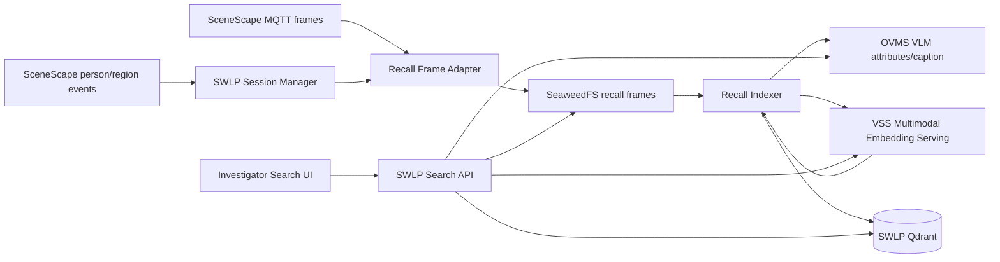
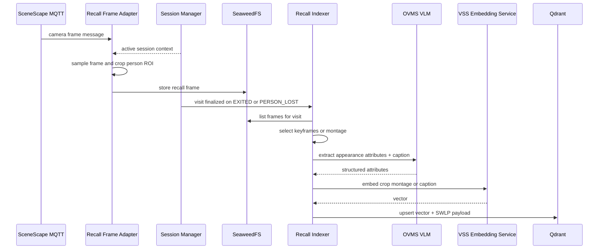
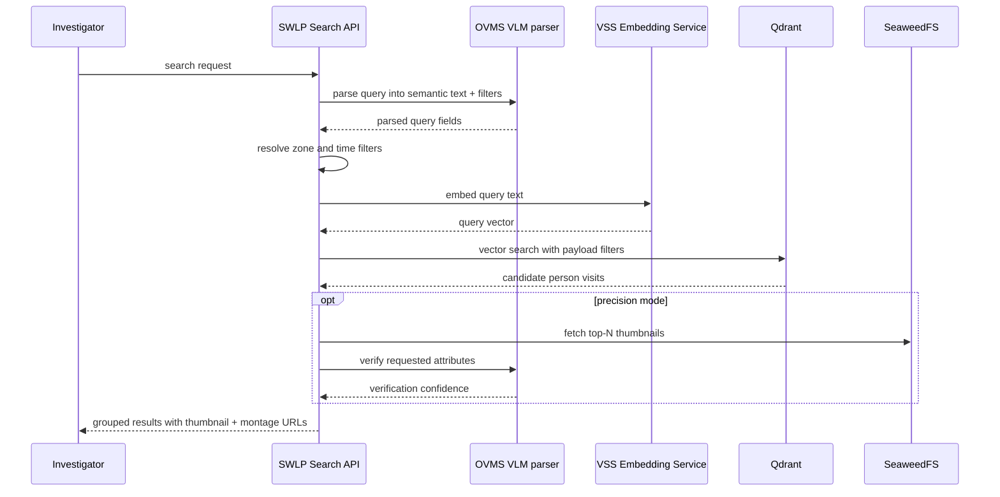

# VLM-Powered Attribute Search With VSS

Status: Draft / Proposal
Component: `storewide-loss-prevention/suspicious-activity-detection`

## 1. Use Case

> "Show me the person in a blue shirt between 2:00-3:00 PM near aisle 7."

This is hybrid recall:

| Query part | Example | Retrieval method |
|------------|---------|------------------|
| Appearance | `person in a blue shirt` | VLM attributes + VSS embeddings |
| Time | `2:00-3:00 PM` | vector DB payload filter |
| Location | `near aisle 7` | `zone_id` / `camera_id` payload filter |

A returned "clip" is not a stored MP4. Today SWLP stores JPG frames in SeaweedFS, so a
clip is a logical person-visit reconstructed as a thumbnail or montage from those frames.

## 2. Current Repo Hooks

| Need | Existing hook | Use in recall feature |
|------|---------------|-----------------------|
| SceneScape frames | `swlp-service/services/mqtt_service.py` dispatches `scenescape/image/camera/+` | Feed recall frame adapter |
| Person identity | `SessionManager.on_scene_data()` keeps canonical `object_id`, cameras, bbox | Group matches across cameras by `person_id` |
| Zone visits | `SessionManager.on_region_event()` emits `ENTERED` / `EXITED` with visit timestamps | Create index records per person visit |
| Frame storage | `FrameManager.store_person_frame()` writes to SeaweedFS | Reuse storage pattern, add recall-specific prefix |
| VLM | `behavioral-analysis/src/vlm_client.py` calls OVMS VLM | Extract appearance attributes and parse queries |
| API | `swlp-service/api/routes.py` owns `/api/v1/lp/*` | Add search and montage endpoints |
| UI | `ui/ui_gradio.py` serves dashboard | Add Investigator Search UI |

Important current limitation: the existing BA frame path stores full camera frames and is
focused on `HIGH_VALUE` zones. Offline recall needs a recall-specific capture/index path
that can include aisle zones and crop the person ROI before embedding.

For example, if the investigator asks for `aisle2`, the system can only answer if frames
for `aisle2` were already captured, stored, and indexed during that time window.

## 3. Design Decision

Use VSS for **embedding generation**, not as the owner of the recall index.

SWLP should own:

- person identity and cross-camera grouping
- time/zone/camera filters
- Qdrant payload schema
- SeaweedFS evidence references
- search API and UI

VSS should provide:

- multimodal embedding service for person crops, montage images, and/or query text

Reason: the VSS video-search ingestion path is file/video oriented. This recall use case is
person-visit oriented and depends on SWLP metadata that VSS does not own.

`2:00-3:00 PM` means a historical query over pre-stored/indexed evidence. It is not a live
VLM scan at query time. Live MQTT frames must be captured and indexed continuously, or video
files must be ingested beforehand, so the query can search existing vectors.

### 3.1 VSS Sample App Findings (Validated)

Reviewed the reference app at
`edge-ai-libraries/sample-applications/video-search-and-summarization` to confirm what it can
and cannot do for the `aisle 7` query. Summary: it is a file-ingest semantic search system with
**time and tag filters only**. It does **not** natively derive `aisle 7` (or any zone) from raw
video.

| Capability | VSS sample app | Evidence |
|------------|----------------|----------|
| Appearance / "blue shirt" similarity | Yes, multimodal embeddings + VDMS retrieval | `search-ms/server.py`, `search-ms/src/vdms_retriever/retriever.py` |
| Time-window filter (`2:00-3:00 PM`) | Yes, explicit `time_filter` + NL time parsing on `created_at` | `search-ms/server.py` `QueryRequest`, `src/utils/time_filters.py` |
| Tag filter | Yes, but tags are **manually supplied at upload** | `pipeline-manager/.../video.controller.ts`, `video.service.ts` |
| Native `aisle2` / zone extraction | No | search query model exposes only `query`, `tags`, `timeFilter` (`search.model.ts`) |
| Person identity / cross-camera grouping | No | ingestion is per-video-file, no `person_id` |
| Live region/zone events | No | "ingestion only supports video files; it does not support live-streaming inputs" (`how-it-works/video-search.md`) |

Key consequence for `person in blue shirt in aisle 7 between 2:00-3:00 PM`:

- VSS can answer **"blue shirt"** (embedding) and **"2:00-3:00 PM"** (time filter).
- VSS cannot answer **"aisle 7"** unless aisle is injected as metadata at ingestion time.
- In the VSS sample app the only injection point is the **tag** field, which is per-video and
  manually set, not per-frame/per-zone. So a single store-camera video cannot be split into
  `aisle 2` vs `aisle 7` regions by VSS alone.

Therefore "process the video using VSS" is **not** sufficient on its own to recover `aisle 7`.
Zone awareness must come from SWLP/SceneScape (region polygons + region enter/exit events),
not from the VSS app.

This validates the Section 3 decision: **use VSS for embedding generation only**, and keep
zone/time/person ownership and payload filtering in SWLP.

### 3.2 Concrete Reuse Boundary

Reuse from the VSS sample app:

- **Multimodal Embedding Serving** only (the `multimodal-embedding-ms` microservice). Wrap it
  behind the SWLP `EMBEDDING_BACKEND=vss_multimodal` client. This is the single dependency.
- Optionally borrow patterns (not the services) for: temporal segment aggregation
  (`retriever.py`) and natural-language time parsing (`time_filters.py`).

Do **not** reuse for the recall index:

- VSS Data Prep / VDMS ingestion path (file/video oriented, no `person_id`/`zone_id`).
- VSS Pipeline Manager search model (only `tags` + `timeFilter`, no zone/person/camera).
- VSS directory watcher (whole-file `.mp4` ingestion, not person-visit oriented).

SWLP owns and must implement (not available in VSS):

- `person_id` identity + cross-camera grouping (from `SessionManager`).
- `zone_id` / `zone_name` resolution from SceneScape region events.
- `camera_id`, visit `start_ms` / `end_ms`.
- Qdrant payload schema and the combined filter
  (`time ∩ zone ∩ camera ∩ person`) described in Section 7.
- Person-ROI crop before embedding (VSS embeds whole frames/clips, not person crops).

So the only thing that flows into VSS is a person crop / montage / caption; everything that
makes `aisle2` answerable stays in SWLP.

## 4. Input And Storage Model

Current BA capture is event-driven for `HIGH_VALUE` zones. VLM recall needs broader
coverage:

1. **Recall-enabled zones**
   - Add a config flag/list for zones that should be searchable, for example `aisle2`,
     `aisle7`, `checkout`, `exit`, or all configured zones.
   - Do not hard-code recall to `HIGH_VALUE`.

2. **Continuous or scheduled capture**
   - While a person is visible in a recall-enabled zone, sample frames at a controlled rate.
   - Store person crops or ROI-focused frames with SceneScape timestamps.
   - The sample rate can be lower than live detection, but it must be enough for visual
     confirmation and attribute recall.

3. **Historical indexing**
   - On visit exit or session expiry, create/update the vector record for that person visit.
   - The index must be ready before an investigator asks the question.

4. **Optional pre-stored video input**
   - If the source is a pre-recorded store video instead of live SceneScape MQTT, run the
     same pipeline as a backfill job: extract frames, associate them with zones/persons,
     store evidence, generate embeddings, and write Qdrant records.

So for `Show me the person in a blue shirt between 2:00-3:00 PM near aisle 7`, the required
input is already-indexed evidence for `aisle 7` during `2:00-3:00 PM`.

## 5. Architecture



## 6. Indexing Flow



Index one record per person visit per camera/zone.

Recommended payload:

```text
clip_id        : uuid
person_id      : SceneScape canonical object_id
scene_id       : SceneScape scene UUID
camera_id      : camera name/id
zone_id        : region UUID
zone_name      : human name, e.g. aisle 7
start_ms       : visit start epoch ms
end_ms         : visit end epoch ms
attributes     : VLM JSON, e.g. upper_color=blue
caption        : normalized appearance caption
thumbnail_key  : SeaweedFS key
frame_keys     : ordered SeaweedFS frame keys
```

## 7. Query Flow



> Cross-modal requirement: the query path embeds **text** while indexing (Section 6) embeds an
> **image crop/montage**. Text-to-image search only works if the VSS model provides a shared
> image-text embedding space. If the selected model does not, make the VLM **caption text** the
> primary indexed vector so both sides embed text. This is tracked in Section 11 (VSS
> Integration: "Which embedding should be primary").

Search filter logic (vector similarity, then payload filters):

```text
vector_score >= score_threshold
AND start_ms < query_end_ms AND end_ms > query_start_ms
AND zone_id IN resolved_zone_ids            # one zone name may resolve to multiple zone_ids
AND optional camera_id IN resolved_camera_ids
AND optional person_id == requested_person_id
```

## 8. Components To Build

1. **Recall Frame Adapter**: `swlp-service/services/recall_frame_adapter.py`
   - Register as another camera-image consumer or fan out from `MQTTService`.
   - Use active `PersonSession` state to associate frames with person/zone/camera.
   - Capture all recall-enabled zones, not only `HIGH_VALUE` zones.
   - Sample frames; do not embed every MQTT frame.
   - Crop person ROI from `session.bbox` or SceneScape camera bounds.
   - Store selected frames under a recall prefix in SeaweedFS.

2. **Recall Indexer**: `swlp-service/services/recall_indexer.py` or standalone service
   - Trigger on `EXITED` / `PERSON_LOST`.
   - Select keyframes, call OVMS VLM, call VSS embeddings, upsert Qdrant.
   - Support one-shot backfill over existing SeaweedFS frames.

3. **VSS Embedding Client**
   - Wrap VSS Multimodal Embedding Serving behind a small client.
   - Hide endpoint/model details behind `EMBEDDING_BACKEND=vss_multimodal`.

4. **Qdrant Service**
   - Add to `docker/docker-compose.yaml` with a persistent volume.
   - Collection should support payload filters on time, zone, camera, and person.

5. **Search API**: `swlp-service/api/routes.py`
   - `POST /api/v1/lp/search/clips`
   - `GET /api/v1/lp/search/clips/{clip_id}/thumbnail`
   - `GET /api/v1/lp/search/clips/{clip_id}/montage`

6. **Investigator Search UI**: `ui/ui_gradio.py`
   - Query box, time range, zone/camera filters.
   - Zone selector should use configured zone names such as `aisle2` / `aisle7`.
   - Results gallery grouped by `person_id` with thumbnail and montage playback.

## 9. API Shape

Request:

```json
{
  "query": "person in a blue shirt between 2:00-3:00 PM near aisle 7",
  "time_start": null,
  "time_end": null,
  "zones": null,
  "camera_ids": null,
  "limit": 20,
  "rerank": true
}
```

- `zones`: optional list of zone names (e.g. `["aisle 7"]`). Each name is normalized and may
  resolve to multiple `zone_id`s. When null, zone is taken from the natural-language parse.
- `camera_ids`: optional list; when null, search spans all cameras attached to the resolved
  zones.

Response (clips grouped by `person_id`; grouping is performed by the API, the UI renders it):

```json
{
  "groups": [
    {
      "person_id": "...",
      "best_score": 0.87,
      "clips": [
        {
          "clip_id": "...",
          "camera_id": "lp-camera1",
          "zone_name": "aisle 7",
          "start_time": "2026-06-10T14:05:12Z",
          "end_time": "2026-06-10T14:06:03Z",
          "score": 0.87,
          "attributes": {"upper_color": "blue", "upper_type": "shirt"},
          "thumbnail_url": "/api/v1/lp/search/clips/.../thumbnail",
          "montage_url": "/api/v1/lp/search/clips/.../montage"
        }
      ]
    }
  ]
}
```

## 10. Phased Plan

1. **Index foundation**: Qdrant, VSS embedding client, recall frame adapter, recall indexer.
2. **Search API**: query parser, zone/time resolution, vector search, thumbnail endpoint.
3. **UI**: Investigator Search tab/section with result gallery and montage playback.
4. **Precision**: optional VLM re-rank, better crop selection, named vectors for image + text.

## 11. Open Questions For Review

Use this section for the architecture/product discussion before implementation.

### Input Coverage

- Should recall work only for persons inside a region boundary, or also for persons near a
   region/camera view even if SceneScape did not emit a region enter event?
- Do we need recall across all cameras by default, or should the query stay scoped to the
   camera(s) attached to the requested zone?

### Video / Clip Storage

- Do we need to store actual video clips for each region, or is storing sampled JPG frames
   enough and generating a montage on demand acceptable?
- If actual clips are required, who creates them: SceneScape/DLStreamer, SWLP, VSS, or a
   separate recorder service?
- If SWLP stores actual video clips, should those clips also be given to VSS for ingestion
   and search, or should VSS only receive extracted frames/embeddings?
- Should clips be stored per camera, per region, per person visit, or as continuous
   time-based segments such as 1-minute MP4 files?
- For `Show me the person in a blue shirt between 2:00-3:00 PM near aisle 7`, should the UI
   play only the matched person's cropped montage, the full aisle camera clip, or both?
- If we store per-region clips, how do we handle overlapping regions visible in the same
   camera frame without duplicating video storage too much?
- What playback quality is expected: thumbnail only, GIF/montage, short MP4 time-lapse, or
   smooth full-fps video?

### Frame Capture And Indexing

- What capture rate is acceptable for recall: 1 fps, 5 fps, current BA cadence, or a
   separate per-zone recall cadence?
- Should the recall adapter crop each person ROI before storing, or store full frames and
   crop later during indexing?
- How do we select the best keyframes for appearance search: largest bbox, least occluded,
   highest pose confidence, or evenly sampled frames?
- Should indexing happen only when a visit exits, periodically during long visits, or both?
- How do we backfill the index if frames or videos already exist before this feature is
   enabled?

### Query Semantics

- When the query says `between 2:00-3:00 PM`, which timezone should be used: store-local
   timezone, browser timezone, or explicit timezone in the request?
- Should user-entered zone names like `aisle 7`, `aisle7`, and `aisle_7` be normalized to
   the same configured zone?
- If the query includes a zone name that is not configured, should the API return an error,
   search all cameras, or ask the user to refine the query?
- Should structured UI filters override the natural-language parse when both are present?
- How should results be grouped: by `person_id`, by camera, by zone visit, or by continuous
   timeline?

### VSS Integration

> Partially answered in Section 3.1 / 3.2: VSS sample app provides only embeddings +
> time/tag filters and cannot derive `aisle2`. Recommended use is **embedding serving only**,
> with SWLP as the primary index. Remaining items below are still open.

- Are we using only VSS Multimodal Embedding Serving, or do we also want to deploy VSS
   search/data-prep services for demos?
- If stored clips are sent to VSS, does VSS become a secondary searchable video index, or
   does SWLP still remain the primary search index with VSS used only for enrichment?
- Which embedding should be primary: cropped person image, compact montage image, VLM
   caption text, or multiple named vectors?
- Does the selected VSS embedding endpoint support the exact input types we need for both
   indexing and query embedding?
- If VSS owns any storage/index internally, how will we join VSS results back to SWLP
   `person_id`, `zone_id`, `camera_id`, and frame/clip URLs?

### Storage, Retention, And Privacy

- How long should recall evidence be retained: hours, days, or configurable per store?
- Should retention apply equally to raw frames/video, generated clips, VLM attributes, and
   vector embeddings?
- Who is allowed to use investigator recall, and do we need audit logs for every query and
   viewed clip?
- Are appearance attributes such as clothing, age range, and gender presentation allowed by
   the product/privacy requirements, or should some fields be removed?

### API And UI

- Should the API return a generated montage URL immediately, or generate clips lazily when
   the investigator opens a result?
- Should the UI show confidence, matched attributes, camera, zone, and exact time range for
   each result?
- Should investigators be able to refine results, for example `same person`, `show next
   camera`, or `expand time window`?
- What is the expected maximum result count and response latency for a one-hour query?

### Operational Concerns

- Can the existing hardware handle continuous recall capture plus VLM/indexing, or do we
   need a separate service/container and rate limits?
- What happens when VSS, Qdrant, or OVMS is down: buffer frames, skip indexing, or mark
   visits as pending?
- How do we monitor index lag so investigators know whether a recent time window is fully
   searchable?
- Do we need a reindex job when prompts, embedding models, zone mappings, or retention
   policies change?
